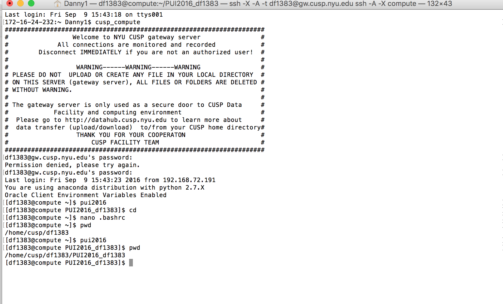

I worked with the following to complete HW1 Assignment 1 and 2:
Avikal,
Victor,
Achilles,
Vishwajeet,
Sokratis,
Saubreen,
Himanshu,
Kristi,
Henry,
Julian

I completed the assignment myself but asked Saubreen and Himanshu numerous questions regarding how Github worked as well as
how to create environment variables. Additionally, i worked in collaboration with the group listed above to overcome any hang ups
through the assignment, including creating directories and linking folders. 

I worked with the following to complete HW1 Assignment 3:
Victor

Victor and I discussed the meaning and validity of each of our distributions by comparing plots. Additionally, Victor pointed me in the direction to find the
numpy normal random multivariate function for the last part of assignment 3.

